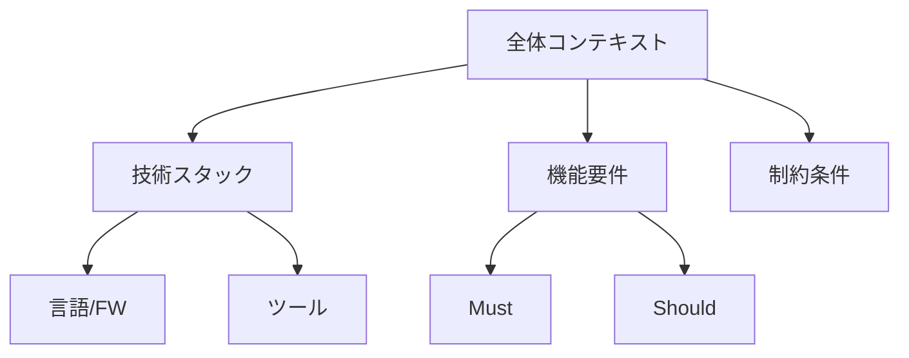

# Column: トークン数の最適化テクニック

LLMとの効果的なコミュニケーションにおいて、トークン数の最適化は重要な要素です。トークン数を適切に管理することで、より正確な応答を得ながら、コストを抑えることができます。

## トークン数の基本

### トークンとは
- 言語モデルが処理する最小単位
- 単語や文字の断片で構成
- モデルによって分割方法が異なる

### 主要なLLMのトークン制限
- GPT-4: コンテキスト窓 8K/32Kトークン
- Claude: コンテキスト窓 100Kトークン
- GitHub Copilot: ファイルサイズに応じて変動

## 最適化テクニック

### 1. プロンプトの構造化
```
# 効率の悪い例
このプロジェクトはTypescriptとReactを使用しています。ESLintの設定があり、Prettierを使用しています。テストにはJestを使用しています。このプロジェクトでユーザー認証の機能を実装したいです。

# 最適化した例
技術スタック:
- TS/React
- ESLint/Prettier
- Jest

要件: ユーザー認証機能の実装
```

### 2. 不要な情報の削除
- 重複する文脈の排除
- 冗長な説明の省略
- 必要最小限のコンテキスト提供

### 3. 効率的なフォーマット
```
# 非効率
Project Details:
The project is using:
- TypeScript for the language
- React for the frontend framework
- ESLint for linting
- Prettier for formatting
- Jest for testing

# 効率的
stack:
ts/react/eslint/prettier/jest
```

## トークン削減パターン

### 1. 階層的な情報提供


### 2. 省略形の活用
- フレームワーク名: React → r
- 言語名: TypeScript → ts
- 一般的な技術用語: Authentication → auth

### 3. 段階的な情報提供
1. 基本要件の提示
2. 必要に応じて詳細を追加
3. フィードバックに基づく補足

## 最適化の実践例

### ユースケース1: API実装

```
# Before (約120トークン)
このプロジェクトではTypeScriptとExpress.jsを使用しているAPIサーバーを開発しています。
データベースはPostgreSQLを使用しています。ユーザー情報を取得するAPIエンドポイントを
実装したいです。セキュリティを考慮した実装にしてください。

# After (約60トークン)
stack: ts/express/pg
task: user GET API
req: secure impl
```

### ユースケース2: テストコード生成

```
# Before (約150トークン)
このReactコンポーネントのユニットテストを書きたいです。テストフレームワークとしてJestと
React Testing Libraryを使用しています。すべての主要なコンポーネントの機能をテストし、
エッジケースも考慮してください。

# After (約80トークン)
test:
comp: UserProfile
tools: jest/rtl
scope: main+edge
```

## トークン数最適化のトレードオフ

### メリット
1. 処理速度の向上
2. コストの削減
3. より多くのコンテキスト保持

### デメリット
1. 可読性の低下
2. 意図の伝達精度低下
3. メンテナンス性への影響

## 推奨プラクティス

1. **目的に応じた最適化**
   - 短い応答が必要な場合は積極的に最適化
   - 複雑な設計には詳細な文脈を維持

2. **段階的なアプローチ**
   - まず基本情報を提供
   - 必要に応じて詳細を追加
   - フィードバックを基に調整

3. **チーム内での標準化**
   - 省略形の規約策定
   - テンプレートの作成
   - レビュープロセスの確立

## Warning
- 過度な最適化は避ける
- 重要な文脈は維持する
- チーム内で理解可能な範囲に留める

## まとめ

トークン数の最適化は、LLMとの効率的なコミュニケーションにおいて重要な要素です。
ただし、最適化と可読性のバランスを取ることが重要です。プロジェクトの特性や
チームの状況に応じて、適切な最適化レベルを選択しましょう。